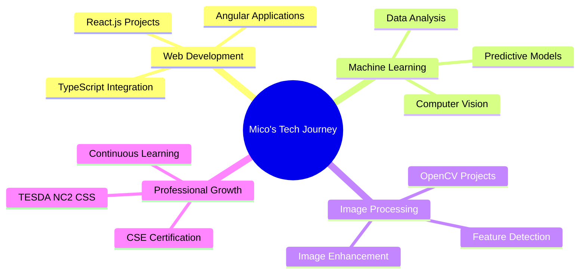

# 👋 Hello, I'm Mico Banzuela!

<div align="center">
  
</div>

<div align="center">
  
  
</div>

---

## 🚀 About Me

```typescript
const mico: Developer = {
  name: "Mico Banzuela",
  username: "Bia495",
  location: "Philippines 🇵🇭",
  education: "BS Computer Science - Bicol University College of Science",
  certifications: ["CSE Professional Passer (May 2024)", "TESDA NC2 - CSS"],

  currentFocus: ["Web Development", "Machine Learning", "Image Processing"],

  technologies: {
    frontend: ["Angular", "React.js", "TypeScript", "HTML5", "CSS3"],
    backend: ["Python", "Node.js"],
    databases: ["MongoDB", "PostgreSQL", "MySQL"],
    tools: ["Git", "Docker", "VS Code"],
    specialties: ["Machine Learning", "Computer Vision", "Image Processing"]
  },

  currentlyLearning: ["Advanced ML Algorithms", "Cloud Computing", "DevOps"],
  askMeAbout: ["Web Development", "Python", "Machine Learning", "Image Processing"],

  funFact: "I love turning complex problems into simple, elegant solutions! 🧩"
};
```

---

## 🛠️ Tech Stack & Tools

<div align="center">

### Frontend Development


### Backend & Programming


### Machine Learning & Data Science


### Tools & Platforms


</div>

---

## 📊 GitHub Analytics

<div align="center">
  
  
</div>

<div align="center">
  
</div>

---

## 🏆 GitHub Trophies

<div align="center">
  
</div>

---

## 🎯 Current Focus Areas

<div align="center">



</div>

---

## 🌟 Featured Projects

<div align="center">

[](https://github.com/Bia495/portfolio-website)
[](https://github.com/Bia495/ml-image-classifier)

</div>

---

## 📈 Contribution Graph

<div align="center">
  
</div>

---

## 🎮 Interactive Elements

<details>
<summary>🎯 Click to see my coding stats!</summary>

### ⚡ Quick Stats
- 🔥 Streak: Building consistent coding habits
- 🌟 Focus: Full-stack development with ML integration
- 🚀 Goal: Contributing to open-source ML projects
- 💡 Learning: Advanced computer vision techniques

### 📚 Currently Reading
- "Hands-On Machine Learning" by Aurélien Géron
- "Clean Code" by Robert C. Martin
- "You Don't Know JS" series

</details>

<details>
<summary>🛠️ My Development Setup</summary>

```yaml
OS: Windows 11
Editor: VS Code with extensions
Terminal: PowerShell with Oh My Posh
Browser: Chrome with DevTools
Design: Figma for UI/UX mockups

Favorite VS Code Extensions:
  - Python
  - Angular Language Service
  - GitLens
  - Prettier
  - Thunder Client
```

</details>

<details>
<summary>🎨 Fun Projects & Experiments</summary>

### 🤖 AI/ML Projects
- Image classification with custom datasets
- Real-time object detection systems
- Sentiment analysis for social media

### 🌐 Web Applications
- Interactive data visualization dashboards
- Progressive Web Apps with offline capabilities
- Real-time chat applications

### 🔬 Research Interests
- Computer Vision in healthcare
- Natural Language Processing
- Edge AI deployment

</details>

---

## 🎵 Currently Vibing To

<div align="center">
  
</div>

---

## 🤝 Let's Connect!

<div align="center">

[](https://linkedin.com/in/mico-banzuela)
[](mailto:mico.banzuela@email.com)
[](https://your-portfolio-url.com)

</div>

---

## 🐍 Watch My Contributions Get Eaten!

<div align="center">


</div>

<!-- If the above doesn't work, here's an alternative -->
<div align="center">
  
</div>

---

## 🎮 Interactive Contribution Heatmap

<div align="center">
  
</div>

---

## 💭 Random Dev Quote

<div align="center">
  
</div>

---

## 🎯 2025 Goals

- [ ] 🚀 Launch 3 major web applications
- [ ] 🤖 Complete advanced ML certification
- [ ] 🌟 Contribute to 5 open-source projects
- [ ] 🎓 Earn developer certifications
- [ ] 📱 Build a mobile app with React Native

---

## 📊 Weekly Development Breakdown

```text
TypeScript   ████████████████████████▓   85.2%
Python       ██████████████▓▓▓▓▓▓▓▓▓▓▓   45.8%
JavaScript   ████████████▓▓▓▓▓▓▓▓▓▓▓▓▓   38.7%
HTML/CSS     ██████████▓▓▓▓▓▓▓▓▓▓▓▓▓▓▓   32.1%
Other        ████▓▓▓▓▓▓▓▓▓▓▓▓▓▓▓▓▓▓▓▓▓   12.4%
```

---

<div align="center">
  
</div>

<div align="center">
  <i>⭐️ From <a href="https://github.com/Bia495">Bia495</a> - Building the future, one line of code at a time! 🚀</i>
</div>

<div align="center">
  <sub>💡 <strong>Pro tip:</strong> Click on the collapsible sections above to discover more about my journey!</sub>
</div>
